# TrustFlow

<div align="center">
  <h1>🛡️ TrustFlow</h1>
  <p><strong>Secure, trustless escrow payment platform backed by Ethereum smart contracts.</strong></p>

  <a href="https://www.python.org/">
    
  </a>
  <a href="https://fastapi.tiangolo.com/">
    
  </a>
  <a href="https://docs.soliditylang.org/">
    
  </a>
  <a href="https://book.getfoundry.sh/">
    
  </a>
  <a href="https://www.docker.com/">
    
  </a>

  <h4>
    <a href="#how-it-works">How It Works</a> |
    <a href="#architecture">Architecture</a> |
    <a href="#tech-stack">Tech Stack</a> |
    <a href="#getting-started">Getting Started</a>
  </h4>
</div>

---

**TrustFlow** is a trustless escrow payment platform backed by an Ethereum smart contract. Funds are locked into an on-chain programmable vault and can only move according to immutable contract rules — without any backend custody or off-chain authorization.

The system intentionally separates:

- **On-chain logic** for financial security and dispute locking
- **Off-chain backend** for user management, agreement orchestration, and auditability

The blockchain is the **single source of truth for funds and financial state**.

---

## How It Works

TrustFlow combines:

- An **off-chain API** for user accounts, agreement drafts, dispute process, and product state
- An **on-chain smart contract** for escrow custody, dispute locking, and settlement

The backend never signs transactions and never moves funds.  
All financial actions are executed directly by user wallets on the smart contract.

1. **Payer** creates an agreement via the API → saved as `DRAFT` in the database (off-chain only, no contract interaction yet).
2. **Payer** calls `createAgreement()` *(on-chain)* on the smart contract, passing the API-issued agreement ID.
3. **Payer** funds the escrow on-chain by calling `fund()` on the contract, depositing ETH into the vault.
4. The **blockchain worker** detects the `AgreementCreated` and `PaymentFunded` on-chain events and syncs the database state (`DRAFT → CREATED → FUNDED`).
5. Once funded, the **Payer** calls `release()` *(on-chain)* to transfer funds to the Payee — or either party calls `openDispute()` *(on-chain)* to escalate to the Arbitrator.
6. If a dispute is opened, the **Arbitrator** settles it on-chain by calling `release()` or `refund()` on the smart contract.
7. The **Arbitrator** then records the resolution via the API, providing the justification. The worker independently detects the on-chain settlement event and updates the final database state (`RELEASED` or `REFUNDED`) and the resolution transaction hash.

---

## Architecture


| Component | Description |
|-----------|-------------|
| `backend/` | FastAPI application + async PostgreSQL (SQLAlchemy + asyncpg) |
| `smart_contract/` | Solidity escrow contract (Foundry toolchain) |
| Blockchain Worker | Standalone process that polls the chain and syncs DB state |
| Nginx | Reverse proxy / rate limiter in front of the API |

> The API and the worker are **separate processes**

---

## Tech Stack

- **Solidity** — smart contract
- **Foundry** — contract toolchain (forge, anvil, cast)
- **Python 3.12 / FastAPI / Uvicorn** — REST API
- **PostgreSQL 16 / SQLAlchemy (async) / Alembic** — database & migrations
- **Google OAuth 2.0 / JWT** — authentication
- **Docker Compose / Nginx** — infrastructure & reverse proxy

---

## Agreement Lifecycle

```mermaid
stateDiagram-v2
    [*] --> DRAFT

    DRAFT --> CREATED : createAgreement() — payer
    CREATED --> FUNDED : fund() — payer

    FUNDED --> RELEASED : release() — payer
    FUNDED --> DISPUTED : openDispute() — payer or payee

    DISPUTED --> RELEASED : release() — arbitrator
    DISPUTED --> REFUNDED : refund() — arbitrator

    RELEASED --> [*]
    REFUNDED --> [*]
```



---

## Project Structure

```
TrustFlow/
├── backend/
│   ├── migrations/            # Alembic migration versions
│   ├── src/
│   │   ├── config.py          # App settings & env vars
│   │   ├── main.py            # FastAPI app entrypoint
│   │   ├── modules/
│   │   │   ├── auth/          # Google OAuth, JWT, session management
│   │   │   ├── users/         # User profiles & wallet addresses
│   │   │   ├── agreements/    # Agreement CRUD & lifecycle
│   │   │   ├── disputes/      # Dispute tracking & arbitration
│   │   │   └── blockchain/    # Chain sync worker
│   │   └── shared/
│   │       └── database/      # SQLAlchemy base & session factory
│   └── tests/
│       └── integration/       # Integration tests (blockchain worker)
├── smart_contract/
│   ├── src/                   # TrustFlowEscrow.sol
│   ├── script/                # Foundry deploy script
│   └── test/                  # Solidity tests
├── docker-compose.yml         # Infrastructure stack (DB, Anvil, Nginx)
└── nginx.conf                 # Reverse proxy configuration
```


Each module has its own `README.md` with detailed documentation:

- [`backend/src/modules/auth/README.md`](backend/src/modules/auth/README.md) — Authentication & session management
- [`backend/src/modules/users/README.md`](backend/src/modules/users/README.md) — User profiles
- [`backend/src/modules/agreements/README.md`](backend/src/modules/agreements/README.md) — Agreement lifecycle
- [`backend/src/modules/disputes/README.md`](backend/src/modules/disputes/README.md) — Dispute resolution
- [`backend/src/modules/blockchain/README.md`](backend/src/modules/blockchain/README.md) — Blockchain worker
- [`smart_contract/README.md`](smart_contract/README.md) — Smart contract API

---

## Getting Started

### Prerequisites

**To run the project:**
- [Docker](https://docs.docker.com/get-docker/)

**For local development / running tests:**
- [Foundry](https://book.getfoundry.sh/getting-started/installation) — smart contract toolchain
- [uv](https://docs.astral.sh/uv/) + Python 3.12+ — backend

### 1. Clone the repository

```bash
git clone https://github.com/BernardoDenkvitts/TrustFlow.git
cd TrustFlow 
```

### 2. Configure variables

Edit `backend/src/config.py` with your values:

```env
# Auth
GOOGLE_CLIENT_ID=your-google-client-id
GOOGLE_CLIENT_SECRET=your-google-client-secret
```

### 3. Start the project

```bash
docker compose up -d --build
```

The API will be available at `http://localhost:8000`. Interactive docs: `http://localhost:8000/docs`.

---

## Running Tests

```bash
# Smart contract tests
cd smart_contract
forge test

# Backend tests
cd backend
uv run pytest
```

---
